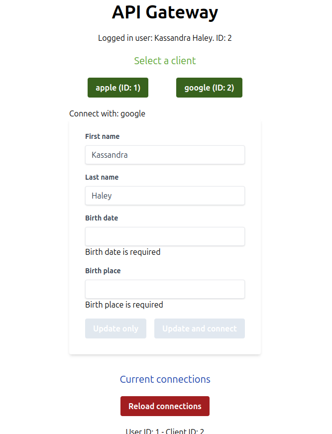

# Sample project

Angular application with dynamic forms and ngrx signals

Users can connect to clients that require a dynamic set of fields



### Instructions

Both processes need to be running:

### To start database:

```sh
npx json-server database.json
```

### To start front end:

```sh
nx serve
```

- Select a client (google or apple) and different fields (coming from database) will be displayed

- Required fields can be modified from the ./database.json file

- If you click on Update and Connect, to see the connection created, you have to click on Reload connections or check the ./database.json
